# Walkthrough — SQL Workspace: Query yang Salah, Lambat, dan Cara Platform Menangkapnya

Query yang error itu mudah: ketahuan. Yang berbahaya adalah query yang **berhasil tapi salah** —
angkanya masuk ke slide direksi. Walkthrough ini menjalankan query lambat dan query salah di SQL
Workspace Enterprise Data Platform, dan menunjukkan apa yang ditangkap platform. Data memakai
**TPC-H** (dataset benchmark standar industri). Semua angka, teks warning, jawaban AI, dan
screenshot di bawah adalah hasil run nyata.

## Skenario

**Budi**, Data Analyst di grup ritel fiktif, harus menyiapkan laporan untuk rapat direksi besok
pagi dari data warehouse `sentosa-dwh` (PostgreSQL, sudah di-scan ke Data Catalog, termasuk
primary key & index).

| Tabel | Baris | Index awal |
|---|---|---|
| `orders` | 150.000 | primary key saja |
| `lineitem` | 600.572 | primary key |
| `customer` / `part` | 150.000 / 200.000 | primary key |
| `nation` / `region` | 25 / 5 | primary key |

Tiga lapis pengaman di SQL Workspace:

| Lapis | Sifat | Fitur |
|---|---|---|
| **Petunjuk performa** | Otomatis & deterministik, setiap query dijalankan | filter tanpa index, kolom dibungkus fungsi, `LIKE '%…'`, filter mustahil, JOIN tanpa kondisi |
| **AI on-premise** | Atas permintaan, berupa saran | AI Review (Logic & Struktur), Jelaskan dengan Bahasa Awam, Explain Plan → bahasa natural |
| **Bukti eksekusi** | Fakta dari query engine | Query Profile, Explain Plan |

---

## Babak 1 — Filter pada Kolom Tanpa Index

```sql
SELECT orderkey, orderdate, totalprice
FROM sentosa_dwh.public.orders
WHERE custkey = 34;
```

Hasil keluar (4 baris), disertai **Petunjuk performa**:

> Filter on orders.custkey has no supporting index — this may cause a full table scan on large tables.

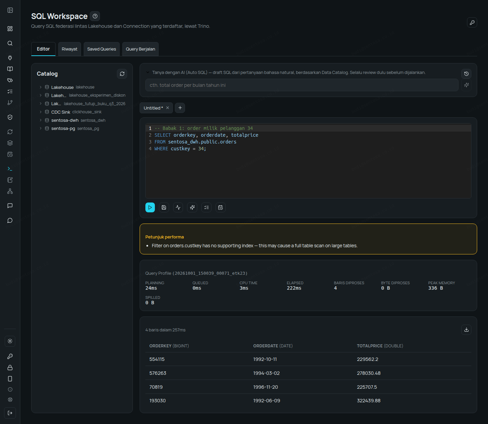

Platform membaca index **asli** dari database sumber lewat Data Catalog — warning-nya spesifik ke
tabel & kolom. DBA membuat index di sumber, lalu connection di-scan ulang:

```sql
CREATE INDEX idx_orders_custkey ON orders(custkey);
CREATE INDEX idx_orders_orderdate ON orders(orderdate);
```

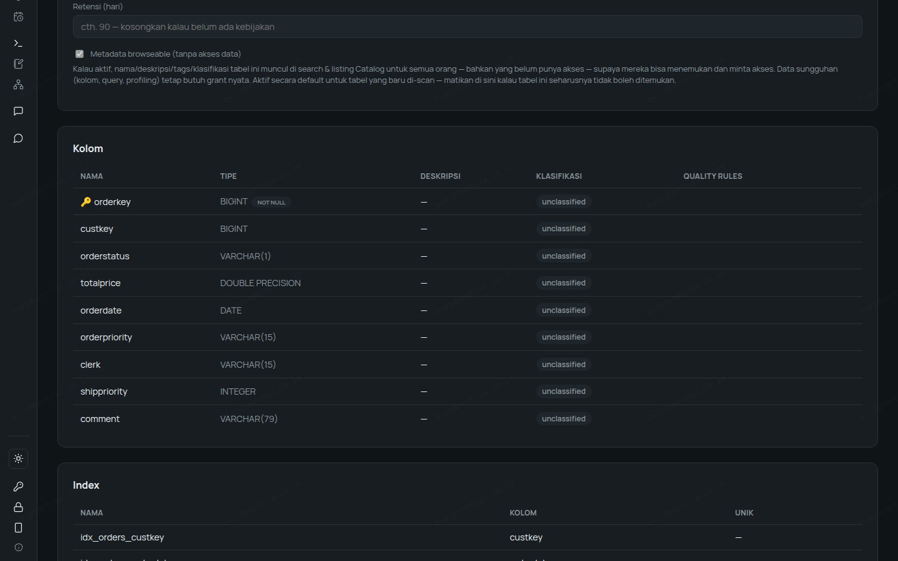

Query yang sama dijalankan lagi — warning hilang.

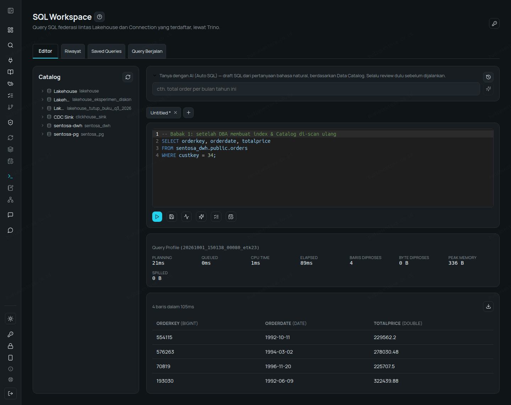

## Babak 2 — Index Ada, tapi Tidak Terpakai

```sql
SELECT orderkey, custkey, totalprice
FROM sentosa_dwh.public.orders
WHERE year(orderdate) = 1997;
```

22.682 baris, dan:

> Filter on orders.orderdate wraps the column in a function/expression — this prevents an index from being used even if one exists.

Index `orderdate` baru saja dibuat — tapi query ini tidak bisa memakainya.

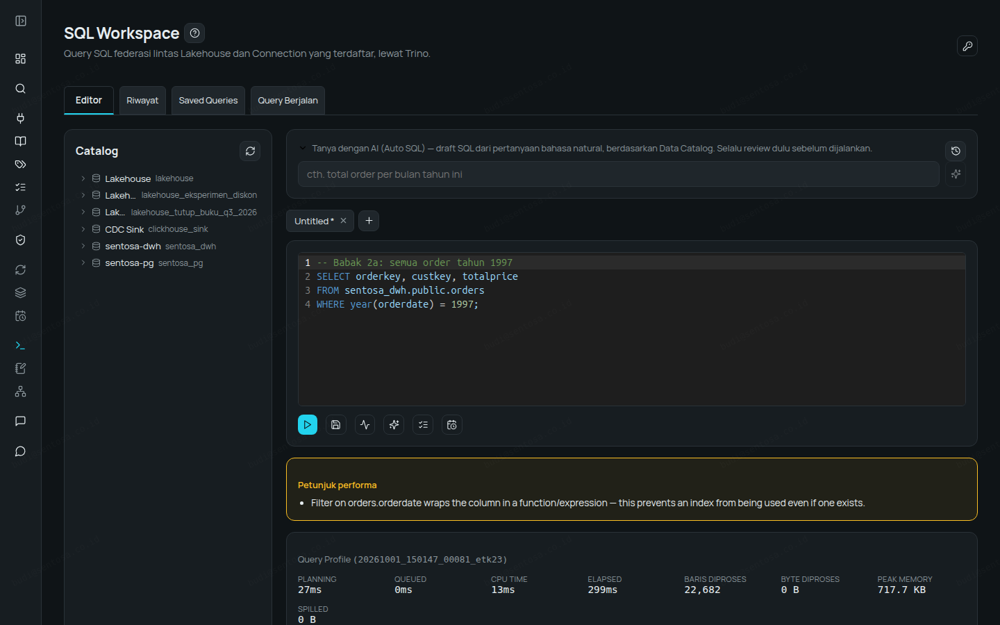

Versi benar memakai rentang tanggal: hasil sama persis (22.682 baris), tanpa warning.

```sql
SELECT orderkey, custkey, totalprice
FROM sentosa_dwh.public.orders
WHERE orderdate >= DATE '1997-01-01' AND orderdate < DATE '1998-01-01';
```

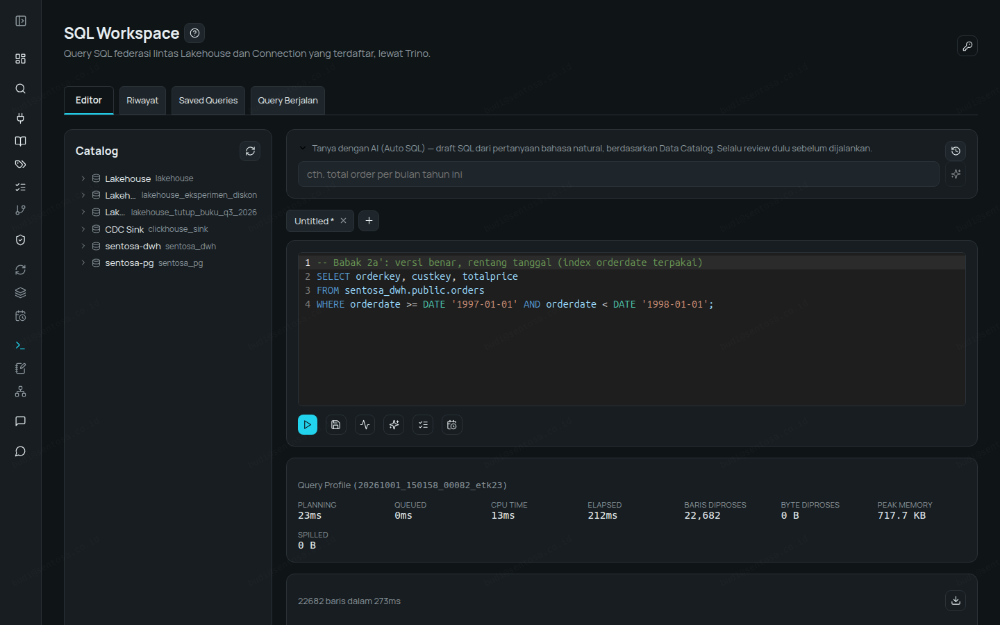

`LIKE` dengan wildcard di depan juga ditangkap:

```sql
SELECT partkey, type, retailprice
FROM sentosa_dwh.public.part
WHERE type LIKE '%BRASS';
```

> Filter on part.type uses LIKE with a leading '%' — this can't use a standard index and forces a full scan.

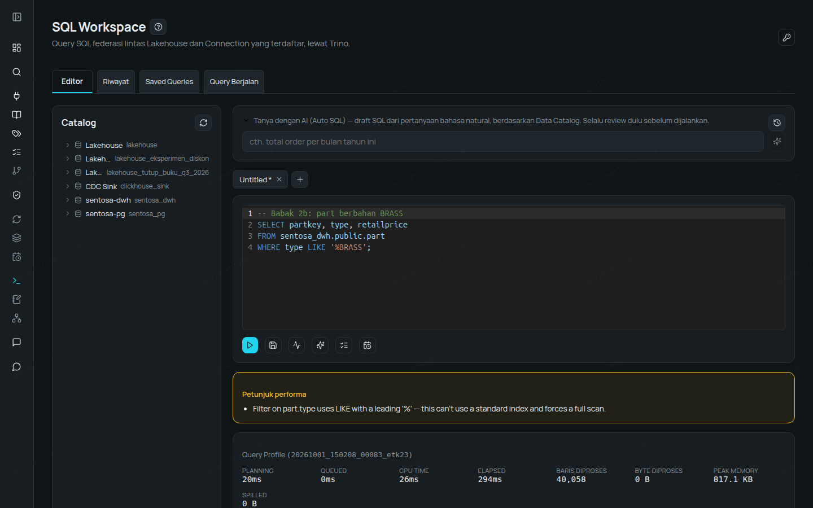

## Babak 3 — Salah tapi "Berhasil"

```sql
SELECT orderkey, totalprice
FROM sentosa_dwh.public.orders
WHERE totalprice > 300000 AND totalprice < 50000;
```

0 baris, **tanpa error** — dan:

> Filters on totalprice contradict each other (> 300000, < 50000) — no row can satisfy all of them, this WHERE condition always returns zero rows.


```sql
-- berapa pasangan negara–wilayah? (seharusnya 25: tiap negara punya 1 wilayah)
SELECT count(*) AS jumlah_baris
FROM sentosa_dwh.public.nation n, sentosa_dwh.public.region r;
```

Hasilnya **125** — 25 negara × 5 wilayah, karena kondisi JOIN terlupa:

> Join to r has no ON/USING condition — every row is matched with every row on the other side (a cartesian product), which is almost always a missing join condition rather than intentional.

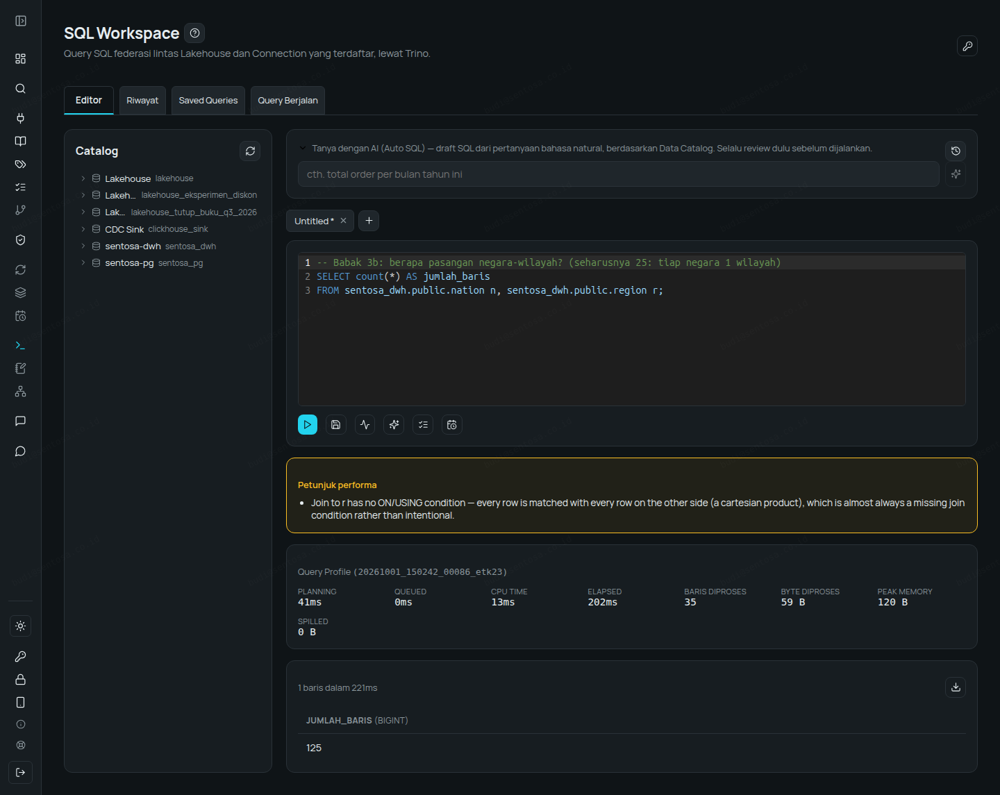

## Babak 4 — Salah Logika yang Butuh "Mata Kedua"

Ada bug yang strukturnya valid, jadi tidak bisa ditangkap aturan deterministik. Di sinilah
**AI Review** (model AI on-premise) membantu.

```sql
-- total nilai order pelanggan 34
SELECT o.custkey, SUM(o.totalprice) AS revenue
FROM sentosa_dwh.public.orders o
JOIN sentosa_dwh.public.lineitem l ON l.orderkey = o.orderkey
WHERE o.custkey = 34
GROUP BY o.custkey;
```

Revenue: **6.479.641**. Tidak ada warning. Klik **AI Review (Logic & Struktur)**:

> The join with `lineitem` is unnecessary and causes the result to be incorrect: it multiplies the order total (`o.totalprice`) by the number of line items (since each order is repeated per line item), inflating the revenue value.

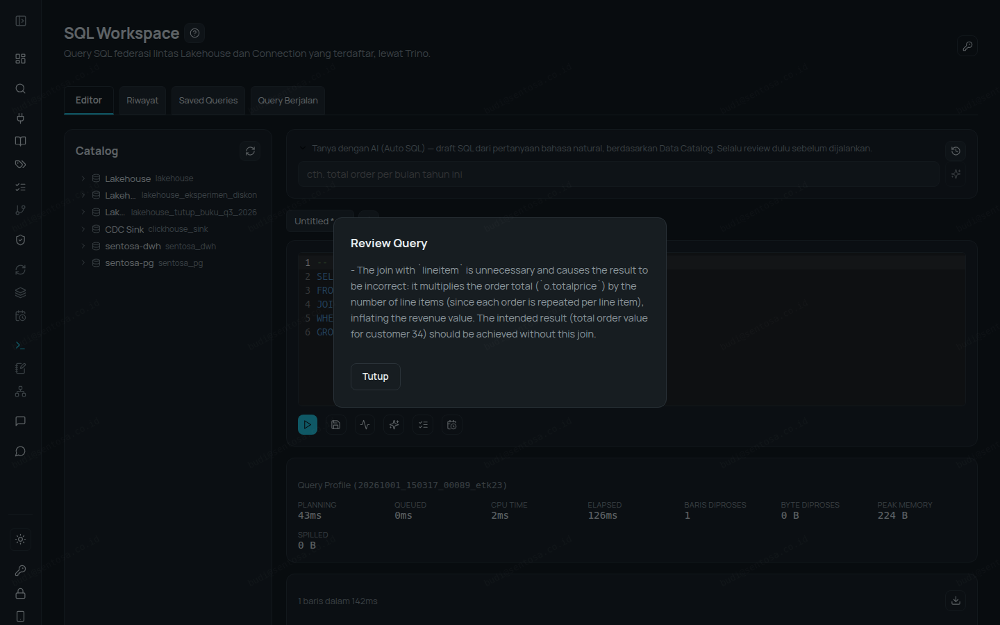

Tanpa JOIN `lineitem`: **1.055.740**. Angka pertama **6× lebih besar** (4 order, 24 item).

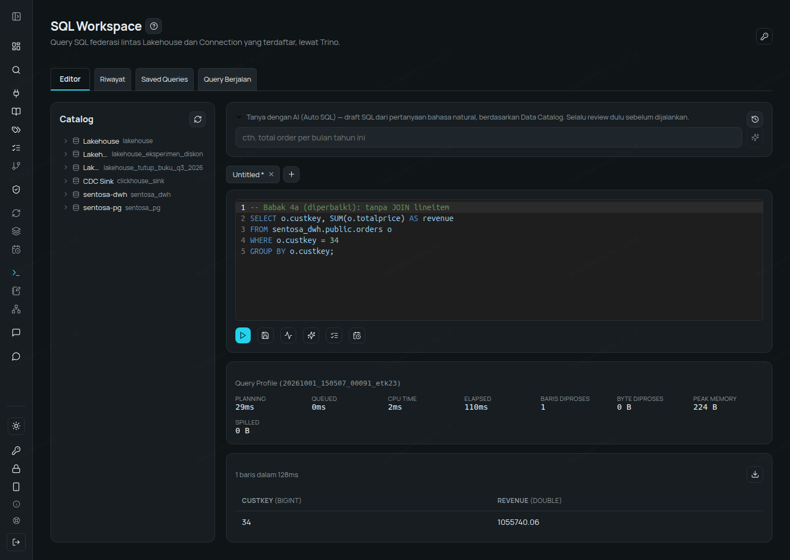

Contoh kedua — prioritas `AND`/`OR`:

```sql
-- order berstatus F atau O yang nilainya > 300.000
SELECT count(*) AS order_besar
FROM sentosa_dwh.public.orders
WHERE orderstatus = 'F' OR orderstatus = 'O' AND totalprice > 300000;
```

Hasil: **77.107**. AI Review:

> Logical error: The `WHERE` clause condition is interpreted as `(orderstatus = 'F') OR (orderstatus = 'O' AND totalprice > 300000)` due to SQL operator precedence (AND binds tighter than OR)… The intended meaning requires parentheses: `(orderstatus = 'F' OR orderstatus = 'O') AND totalprice > 300000`.

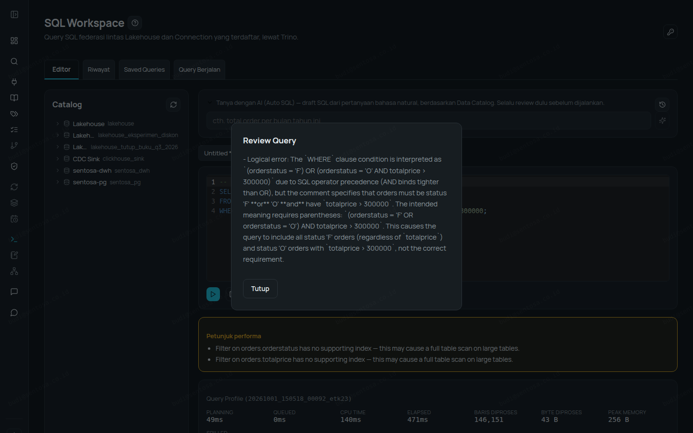

Dengan kurung: **8.343** — angka pertama 9× lebih besar.

Aturan deterministik hanya melaporkan yang pasti; AI Review memberi saran untuk pola yang butuh
pemahaman maksud — ditandai sebagai saran, bukan vonis.

## Babak 5 — Memahami Query Warisan

Budi mewarisi query tanpa dokumentasi (TPC-H Q3). **Jelaskan dengan Bahasa Awam (AI)**:

> This query finds the **top 10 highest-revenue orders** for customers in the "BUILDING" market segment that were **ordered before March 15, 1995** but **shipped after March 15, 1995**.

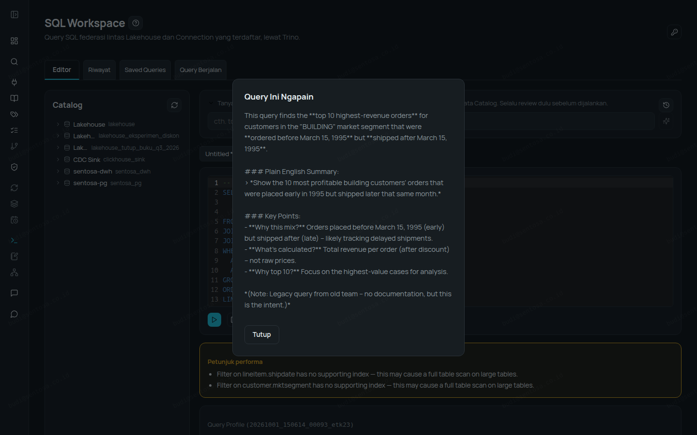

**Explain** menampilkan plan asli dari query engine, lalu **Jelaskan dengan bahasa natural**
meringkasnya: tabel yang dibaca, filter yang di-push ke sumber, urutan JOIN, sekitar 93 ribu baris
diproses, tidak ada operasi mahal — dengan catatan "dibuat oleh model AI on-premise… sebagai
panduan, bukan jaminan".

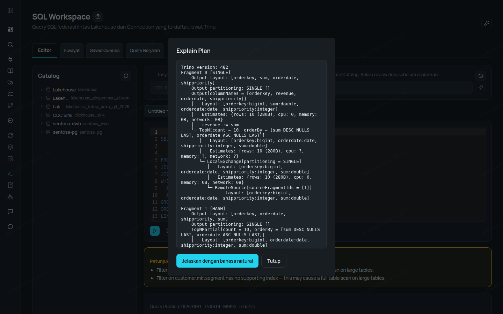
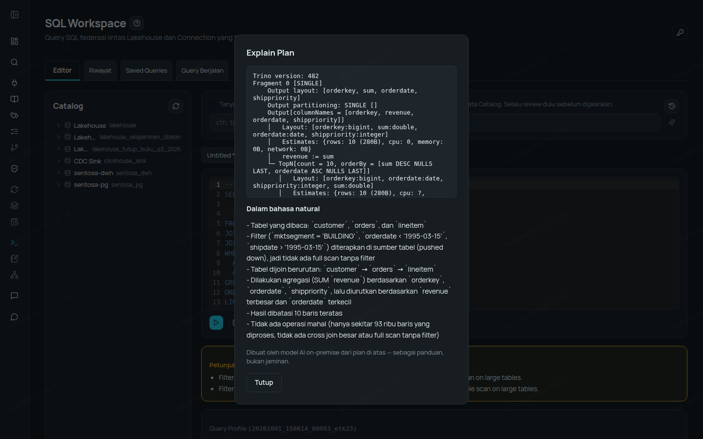

## Babak 6 — Menjadikannya Aset Tim

Query yang sudah benar disimpan ke **Saved Queries** dan dibagikan ke tim; **Riwayat** mencatat
setiap eksekusi (waktu, status, durasi, jumlah baris).

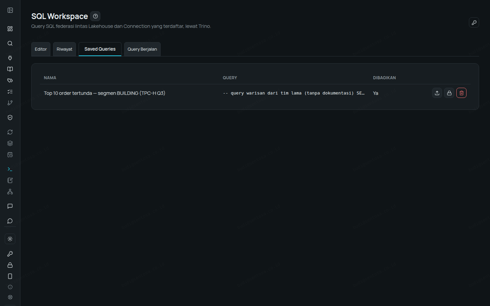
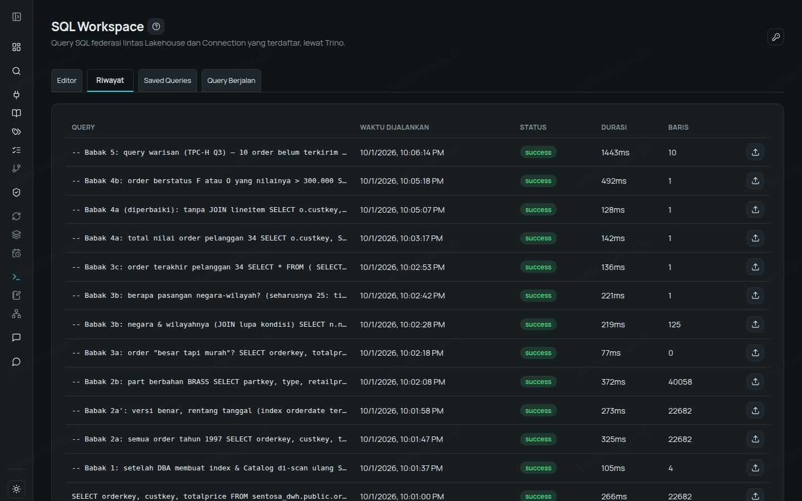

---

## Ringkasan

| Masalah | Ditangkap oleh | Bukti |
|---|---|---|
| Filter tanpa index | Petunjuk performa | warning hilang setelah index dibuat |
| Index ada tapi tidak terpakai (`year()`, `LIKE '%…'`) | Petunjuk performa | hasil sama, tanpa warning |
| Filter mustahil | Petunjuk performa | 0 baris tanpa error |
| JOIN tanpa kondisi | Petunjuk performa | 125 baris, seharusnya 25 |
| JOIN fan-out | AI Review | 6× lipat |
| Prioritas AND/OR | AI Review | 9× lipat |
| Tidak paham query / plan | Jelaskan (AI), Explain Plan + bahasa natural | — |

Semua AI di walkthrough ini berjalan **on-premise** — query dan metadata tidak dikirim ke layanan
AI publik. Masking & hak akses tetap berlaku di setiap query.

**Coba 14 hari, tanpa sales call:** https://alzizan.co.id/register
